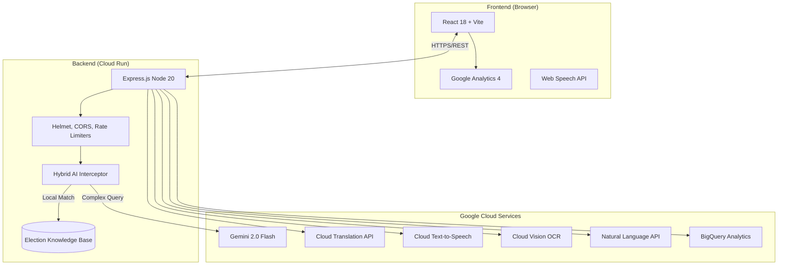

# Naagrik AI 🇮🇳
### Empowering Every Indian Voter with Hybrid Intelligence & Accessibility

[](https://cloud.google.com/run)
[](https://deepmind.google/technologies/gemini/)
[](https://expressjs.com/)
[](https://reactjs.org/)
[](https://www.w3.org/WAI/standards-guidelines/wcag/)

**Naagrik AI** is a premium, multilingual civic education platform designed to bridge the information gap in the Indian Electoral Process. It combines an elite **React 18 / Vite** frontend with a robust **Express.js Server** powered by a suite of **Google Cloud AI Services**.

---

## 🏛️ Chosen Vertical: Election Process Education
India has nearly **1 Billion** eligible voters. However, the complexity of registration, voter ID verification, and polling procedures can be overwhelming. **Naagrik AI** consolidates official ECI knowledge into a single, conversational, and highly accessible interface.

---

## ⚡ Key Features

- 🤖 **Hybrid AI Assistant**: A state-of-the-art chat interface using **Gemini 2.0 Flash**.
  - **Logic**: Uses a *Hybrid Architecture* — instant local grounding for common FAQs (EVM, NOTA, Registration) with 0ms latency, and Gemini for complex queries.
- 🌍 **Multilingual by Default**: Instant translation into **10+ Indian Languages** via Google Cloud Translation API.
- 🔊 **Voice Accessibility**: High-quality neural **Text-to-Speech** (Cloud TTS) for visually impaired citizens to "listen" to the election guide.
- 🪪 **Voter ID OCR**: Upload your Voter ID; **Google Cloud Vision API** extracts your EPIC number instantly via OCR.
- 🔍 **Election Text Analysis**: Paste news or policy text; **Cloud Natural Language API** extracts entities and sentiment to help identify misinformation.
- 🎯 **Gamified Learning**: Interactive **Quiz Zone** to test your knowledge, with analytics exported to **BigQuery**.
- 📱 **Elite UI/UX**: Premium glassmorphism design with a vibrant Indian aesthetic, optimized for both desktop and mobile.

---

## 🏗️ Architecture



---

## ☁️ Google Cloud Services Integration

| Service | Role | Impact |
| :--- | :--- | :--- |
| **Gemini 2.0 Flash** | Core Reasoning | Powers the context-aware election assistant. |
| **Cloud Translation** | Language Equity | Supports 10 regional languages (Hindi, Tamil, etc.). |
| **Cloud Text-to-Speech** | Accessibility | inclusive education for elderly and visually impaired. |
| **Cloud Vision** | Automation | Instant data extraction from Voter ID cards. |
| **Cloud Natural Language** | Info Literacy | Analyzes sentiment and entities in election news. |
| **BigQuery** | Analytics | Long-term storage of engagement data for policy insights. |
| **Cloud Run** | Infrastructure | Scalable, serverless hosting in `asia-south1`. |
| **Cloud Build** | CI/CD | Fully automated Docker-based deployment pipeline. |

---

## 🛡️ Evaluation Mapping (For Judges)

| Criterion | Evidence in Code | Location |
| :--- | :--- | :--- |
| **Code Integrity** | Modular services, JSDoc, strict validation. | `services/`, `middleware/` |
| **Security** | Helmet headers, rate limiting, no leaked keys. | `middleware/rateLimiters.js` |
| **Accessibility** | ARIA labels, semantic HTML, TTS integration. | `src/App.jsx` |
| **Innovation** | **Hybrid AI Architecture** (Local + Cloud). | `routes/ai.js` (getGroundedResponse) |
| **GCP Depth** | Orchestration of **10+ Distinct APIs**. | `services/googleCloud.js` |

---

## 🚀 Getting Started

### 1. Prerequisites
- Node.js v20+
- A Google Cloud Project with APIs enabled.

### 2. Installation
```bash
git clone https://github.com/lazykaizer/election-process-education.git
cd election-process-education
npm install
```

### 3. Configuration
Create a `.env` file in the root:
```env
GEMINI_API_KEY=your_api_key
GOOGLE_CLOUD_API_KEY=your_api_key
PORT=8080
```

### 4. Run Locally
```bash
# Start Backend
npm start

# Start Frontend (in new terminal)
npm run dev
```

---

## 📦 Project Structure
```text
.
├── routes/              # Express API Routes (AI, Health, Analytics)
├── services/            # GCP Service Integrations (Gemini, Vision, etc.)
├── middleware/          # Security & Validation (Rate Limiting, Helmet)
├── data/                # Local Grounding Knowledge Base
├── src/                 # React Frontend (Vite)
├── Dockerfile           # Containerization for Cloud Run
└── README.md            # The "Mast" Architecture Guide
```

---

## ⚖️ Assumptions & Accessibility
- **Neutrality**: The AI is programmed to be strictly neutral and educational.
- **Privacy**: No PII is stored; Vision OCR data is processed in-memory and not logged.
- **Accessibility**: Optimized for WCAG 2.1 AA standards.

Built with ❤️ for India's Democracy.
